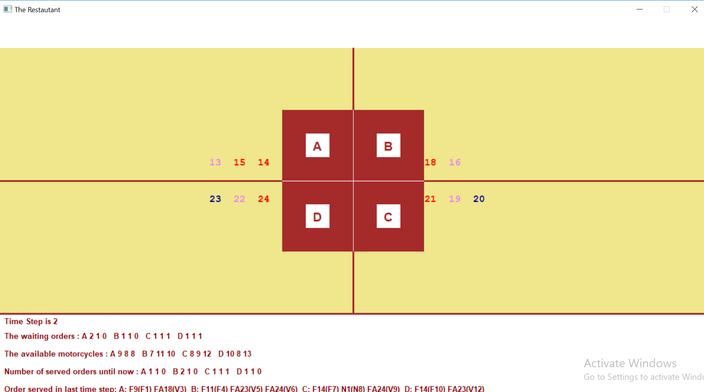

# :motor_scooter: Data_Structure_Restaurant

A GUI of a restaurant that shows the orders arrived to that restaurant ,and how the restaurant acts to deliver:motor_scooter: these orders.
:bread: 	  :croissant: 		
:baguette_bread: 	
:pretzel: 		
:bagel: 	 	
:pancakes: 
:waffle:      
:cheese: 	
:meat_on_bone:
:poultry_leg: 
:cut_of_meat: :bacon: 	
:hamburger:   :fries: 	
:pizza: 	  :hotdog: 
:sandwich: 	  :taco: 	
:falafel: 	  :egg: 
:fried_egg:   :shallow_pan_of_food: 
:stew:   	  :bowl_with_spoon: 
:green_salad: :popcorn: 

# Screenshots

# Run 
Run Visual studio 

Choose GUI mode(interactive, step by step, silent, demo)

Enter input file name

